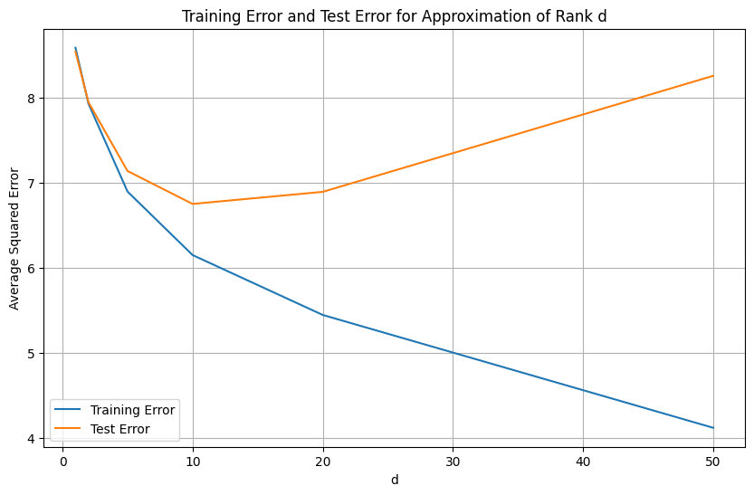
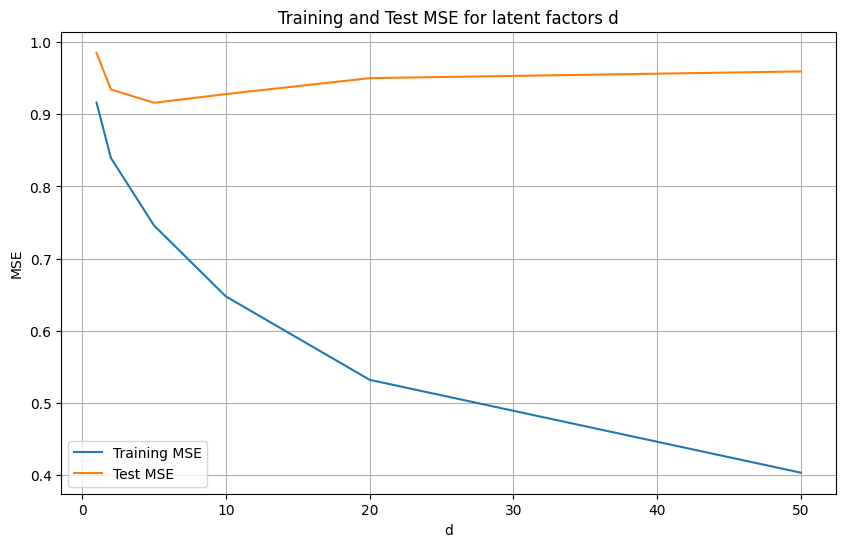

# Movie Recommendation System

## Overview
This project implements a personalized movie recommendation system using the MovieLens 100k dataset. The goal is to predict user ratings for movies based on historical ratings. The system demonstrates the following approaches:

- **Rank-one estimator**: Predicts each movie’s rating as the average of ratings from all users.
- **Rank-d SVD approximation**: Uses singular value decomposition for low-rank approximations of the rating matrix.
- **Alternating minimization with regularization**: Learns latent factor representations for users and movies, optimizing for mean squared error (MSE) only on observed ratings.

---

## Dataset
- **MovieLens 100k**: 100,000 ratings from 943 users on 1,682 movies.
- Each user rated at least 20 movies.
- Dataset source: [https://grouplens.org/datasets/movielens/100k/](https://grouplens.org/datasets/movielens/100k/)

---

## Skills / Technologies
- **Programming & Libraries**: Python, NumPy, SciPy, PyTorch, Matplotlib
- **Mathematics / ML Concepts**: Linear algebra, singular value decomposition, matrix factorization, latent factor models, regularization
- **Software Practices**: Modular code, function encapsulation, reproducible experiments
---
## Features

This repository contains a **single Python script** that handles:
- Data loading and processing
- Modeling and matrix factorization
- Training
- Evalutuation
- Result visualization
---
  ## Results
We investigate the accuracy of our different estimators i.e if user j likes movie i

### SVD Approximations

*Training and test MSE for different latent factor dimensions using SVD.*

### Alternating Minimization

*Training and test MSE for different latent factor dimensions using alternating minimization.*

## Project Structure
- `README.md`→ youre here! the main project description :)
- `movie_recommendations` → main python code
- `results/`
  - figures of MSE results
---

## Installation
1. Clone the repository:
```bash
git clone https://github.com/YOUR_USERNAME/matrix-recommendation-system.git
cd matrix-recommendation-system

run the main script:

python movie_recommendation.py